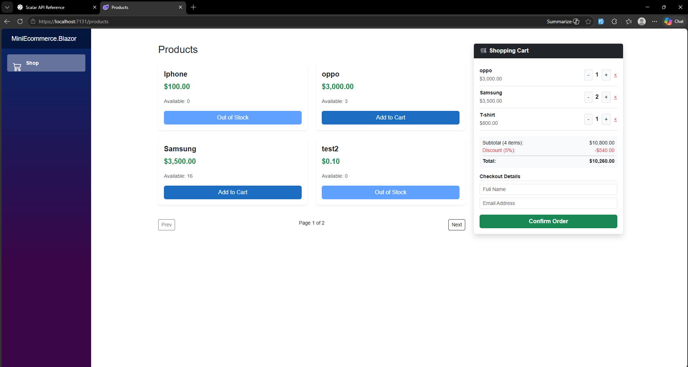

# 🛒 Mini E-Commerce System

A full-stack mini e-commerce application built using .NET 9 and Blazor, demonstrating clean architecture principles and backend fundamentals such as product management, order processing, and discount calculation.

---

## 🚀 Tech Stack

- Backend: ASP.NET Core Web API (.NET 9)
- Frontend: Blazor Interactive Server
- Database: SQL Server (LocalDB)
- ORM: Entity Framework Core (Code First)

---

## ✨ Features

- Create products with validation (Price > 0, Stock ≥ 0)
- List products with pagination
- Add items to cart and manage quantities
- Create orders with stock validation
- Automatic discount calculation:
  - 2–4 items → 5%
  - 5+ items → 10%
- View order details including subtotal, discount, and total

---

## 🧱 Architecture

The project follows a layered architecture with separation of concerns:

- Service Layer for business logic
- Generic Repository for data access abstraction
- Unit of Work for transaction management
- Specification Pattern for query flexibility (pagination & includes)
- DTOs to separate API contracts from domain models

> Note: Some patterns were applied in a simplified manner to demonstrate scalability while keeping the project readable.

---

## 🔌 API Endpoints

### Products
- `GET /api/products?pageIndex=1&pageSize=4`
- `POST /api/products`

### Orders
- `POST /api/orders`
- `GET /api/orders/{id}`

---
## 📸 Screenshot

## ⚙️ How to Run

### 1. Database Setup
- Update `DefaultConnection` in:
  `MiniEcommerce.API/appsettings.json`
- Run:

### 2. Run the Application
- Set both projects as startup:
  - MiniEcommerce.API
  - MiniEcommerce.Blazor

### 3. Access
- API Docs: `/scalar/v1`
- UI: `/products`

---

## 👨‍💻 Author

Mohamed Mustafa
